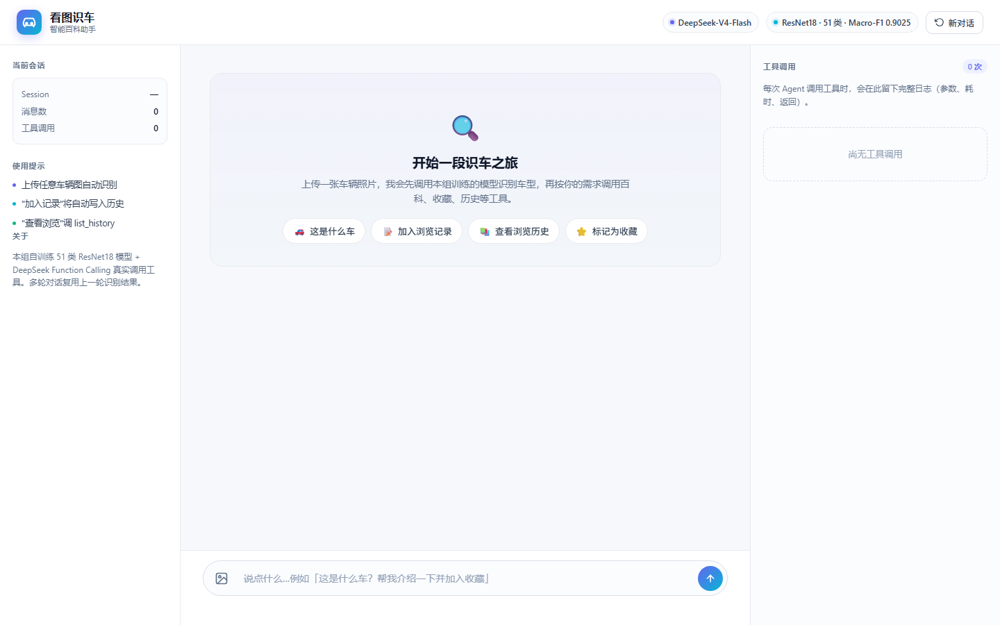
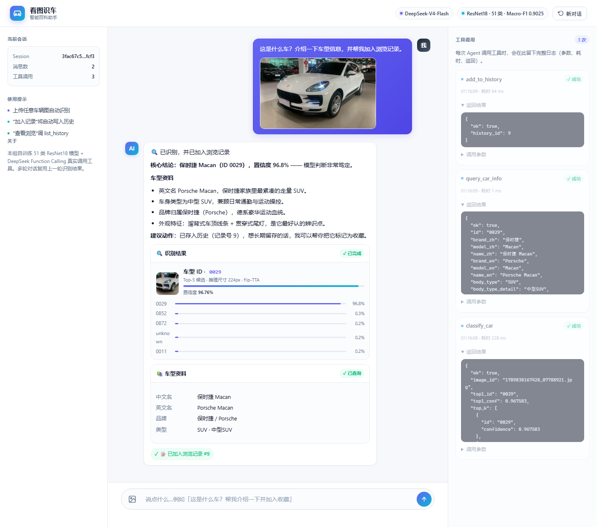

# 看图识车 · 智能百科助手

> 智能系统综合实训项目：**50 个车型 + unknown 共 51 类**图像分类模型 → DeepSeek 智能体（Function Calling）→ FastAPI Web 应用。

**51 类 Macro-F1 = 0.9025**（验证集 1928 张）

---

## 效果

| 指标 | 数值 |
| --- | --- |
| 51 类 Macro-F1（验证集） | **0.9025** |
| Accuracy | 0.8849 |
| unknown 类 F1 | 0.8061 |
| 模型 | ResNet18 + 51 类分类头（11.21 M 参数） |
| 推理 | 224×224 + 水平翻转 TTA |

注意：并非在整个 827 类数据集上训练。任务要求只选 50 类训练，其余全部归入 `unknown`（开放集识别）。评分指标是 **51 类 Macro-F1**——unknown 与每个已知类等权，因此 unknown 类别的样本配比是本项目最关键的设计点（详见 [PROJECT_CONTEXT.md](PROJECT_CONTEXT.md) 第 7.3 节）。

---

## 界面预览

**首页**：上传一张车辆照片，或直接点快捷指令开聊。



**一次对话串联三个工具**（识图 → 查百科 → 记入浏览记录），左侧是识别与百科卡片，右侧是 Agent 的实时工具调用日志：



## 功能

上传一张车辆照片，智能体会：

1. **识别车型**（`classify_car`，调用本项目自己训练的模型）
2. **查车型资料**（`query_car_info`：中文名 / 英文名 / 车身类型）
3. **记入浏览历史**（`add_to_history`）、**标记收藏**（`mark_favorite`）、**查询历史**（`list_history`）

支持一个任务串联 3 个以上工具，支持多轮上下文（例如第 2 轮不重复传图，直接说「把它标记为收藏」）。

---

## 快速开始

```bash
# 1. 安装依赖
pip install -r requirements.txt

# 2. 配置 API Key（.env 不会被提交）
cp .env.example .env
#    编辑 .env，填入 DEEPSEEK_API_KEY=sk-xxxxx

# 3. 准备模型权重（本仓库不含 best.pt，44.8 MB）
#    方案一：自行训练，见 PROJECT_CONTEXT.md 第 6 节
#    方案二：从本仓库 Release 下载并放到 checkpoints/best.pt

# 4. 启动 Web
python -m uvicorn src.web.app:app --host 127.0.0.1 --port 8000
#    浏览器打开 http://127.0.0.1:8000
```

命令行推理：

```bash
python -m src.inference single --image 图片.jpg
python -m src.batch_predict --test-dir 测试图目录 --out predictions.csv --tta flip
python -m src.evaluate --img-size 224 --tta flip --make-confusion-png
```

> **Windows + Anaconda 用户**：运行前需设置环境变量 `KMP_DUPLICATE_LIB_OK=TRUE`，否则会因 libiomp5md.dll 重复加载而崩溃。

---

## 项目结构

```
├── classes.txt            # 50 个车型 ID（按升序、UTF-8 无 BOM）
├── predictions.csv        # 预测结果：image_id,predicted_label,confidence
├── PROJECT_CONTEXT.md     # ★ 完整上下文文档（技术方案 / 开发历程 / 踩坑 / 上传说明）
├── src/
│   ├── data_prep.py       # 选类 + unknown 采样
│   ├── train.py           # 训练（支持 MixUp / 余弦退火）
│   ├── evaluate.py        # 评估（Macro-F1 / 混淆矩阵 / TTA / 温度）
│   ├── inference.py       # 单图推理
│   ├── batch_predict.py   # 批量推理
│   ├── agent.py           # DeepSeek Function Calling 主循环
│   ├── tools/             # 5 个 Agent 工具
│   ├── utils/             # Dataset / 模型 / 指标
│   └── web/               # FastAPI 应用
└── report/                # 实训报告（md + docx）
```

---

## 技术要点

- **迁移学习**：ResNet18（ImageNet 预训练）替换分类头为 51 类
- **unknown 类设计**：作为**独立类别**参与训练，不靠置信度阈值替代
- **数据再平衡**：unknown 从 1500 张降至 500 张（占比 24.5% → 9.8%），使已知图被误判为 unknown 的比例从 11.85% 降到 **6.87%**
- **MixUp + 余弦退火**：抑制过度自信、稳定后期收敛
- **水平翻转 TTA**：推理阶段零成本提分（5-crop TTA 经实验否决——车辆主体居中，四角裁剪切掉判别性区域）
- **拒识阈值**：在验证集上标定（任务书要求），v2 标定结论为"无需事后干预"

---

## 不包含在本仓库中的内容

| 未包含 | 原因 |
| --- | --- |
| 数据集（10 万+ 张图，约 6.6 GB） | 版权不归本项目所有；GitHub 单文件上限 100 MB |
| 模型权重 `best.pt`（44.8 MB） | 二进制大文件会膨胀 git 历史；通过 Release 分发或自行训练 |
| `.env` | 含真实 API Key |
| 教师任务书、课程脚手架 | 第三方材料 |

复现方式见 [PROJECT_CONTEXT.md](PROJECT_CONTEXT.md) 第 6 节。
